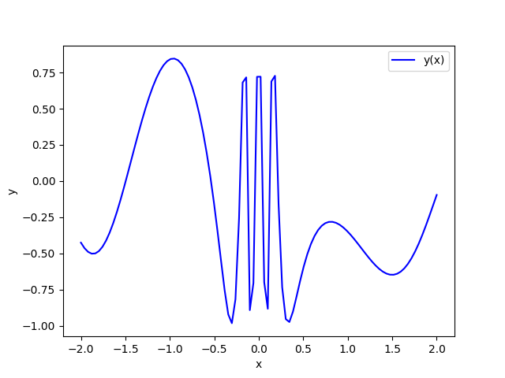
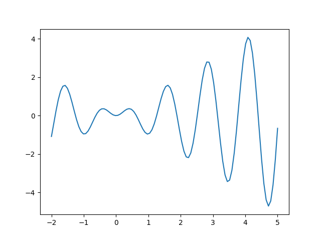

## Візуалізація даних у Python
## Лабораторна №15
### Ціль: Ознайомитись з методами візуалізації даних у Python

#### Алгоритм виконання завдання:

 - Використовуємо бібліотеку *matplotlib*.
 - Для допомогою данной бібліотеки будуємо графік функції *Y(x)=1/x*sin(5*x); x=[-5...5]*.
 - Додаємо легенду та підписуємо осі(х;у).
 - Виводимо графік на указаній області и зберігаємо у 1.png.
 - Використовуємо бібліотеку plotly.
 - Для допомогою данной бібліотеки будуємо графік функції  Y(x)=5*sin(10*x)*sin(3*x)/(x^x), x=[0...8].
 - Додаємо легенду та підписуємо осі(х;у).
 - Зерігамо графік у out.pdf та line-model.html.

### Приклад роботи першої програми

### Приклад роботи другої програми
